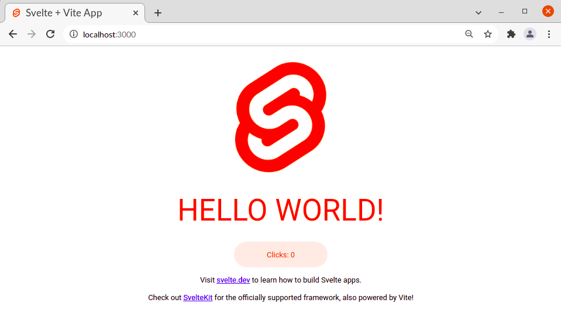
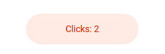
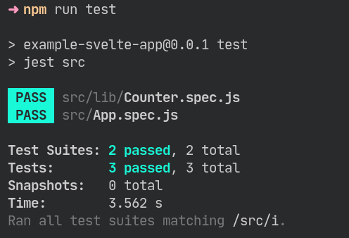

# Svelte + Vite + Jest Template App

This template should help get you started developing with Svelte in Vite, and testing with Jest.

The template is based on the template from the Vite website created by running the following:

```bash
npm init vite@latest example-svelte-app -- --template svelte
cd example-svelte-app
npm install
```

This creates a default "Hello World" project. The homepage says "HELLO WORLD!" and has a counter button courtest of a `Counter` component.



Clicking the button will update it the number in its inner text.



We can run the project with `npm run dev` and visit it at <localhost:3000>.

## But testing

The Vite template has no testing setup included. Testing your app is advisable! I did the ugly work of getting the right packages together for you.

There are tests for the `App` and `Counter` components included. You can run the test suites with `npm run test`. To run Jest in watch mode, you can run `npm run test:watch`.



You can get the full background on this set-up in the article I wrote - [Testing a Svelte app with Jest](https://www.roboleary.net/2021/11/18/svelte-app-testing-jest.html) - it also discusses the testing of a complete app. You may encounter some compatiability issues when you use third-party libraries as Jest does not support ES Modules (it is an experimental feature currently).

Happy Svelte-Vite-Jesting!
